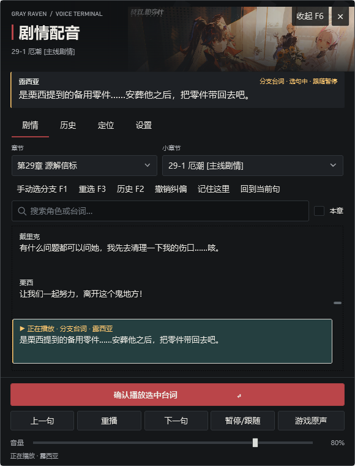
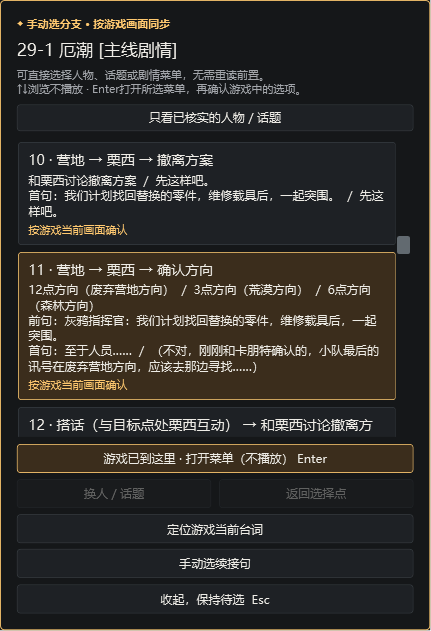
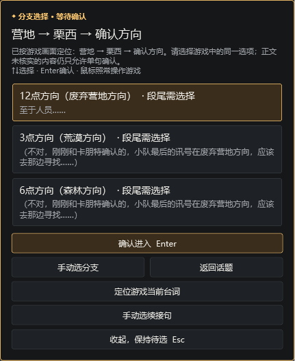
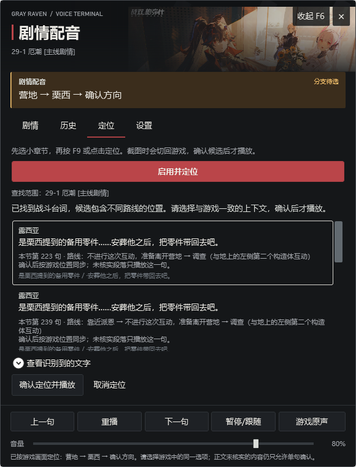

# 战双帕弥什 · 剧情配音播放器（Windows 桌面版）

非官方的**剧情配音辅助工具**，Windows 原生 WPF 实现。跟着游戏剧情逐句播放配音，支持**游戏文字跟随**（直接读取游戏当前对白）、手动分支定位，以及可选的 OCR 截图定位。

| | |
|---|---|
| **版本** | `2026.10.9.9`（`2026.10.09-settings-validation`） |
| **系统要求** | Windows 10 / 11 **x64** |
| **运行权限** | **需要管理员权限** —— 读取游戏进程对白所需 |
| **技术栈** | .NET 10（WPF + WinForms）、NAudio 2.2.1、SDL3 |

> 这是**源代码仓库**，编译产物不在这里。
> 程序下载、40 章配音包与使用说明：[**pgr-voice-pack**](https://github.com/abc85713344/pgr-voice-pack)
> Android 版源码：[**pgr-voice-android**](https://github.com/abc85713344/pgr-voice-android)

## 界面

| 手动分支主面板 | 分支目录 |
|---|---|
|  |  |

| 方向分支选择 | OCR 定位 |
|---|---|
|  |  |

## 功能

- **游戏文字跟随**（推荐）—— 直接从游戏进程读取当前对白文本，自动定位并播放对应录音。**不需要截图，也不需要 OCR。** 分「普通对白」和「3D 营地 / 战斗对白」两路分别连接，会读取角色名以区分不同角色说出的相同台词。
- **键盘 / 手柄跟随** —— 先在台词页选中当前句，再按键跟随（默认空格）。
- **点按跟随** —— 在游戏里设置一个点击热区，轻点时配音跟一句。热区平时鼠标穿透，不抢游戏操作。
- **顺序播放** —— 按共同线台本顺序播放并自动点击，遇到分支停下。
- **配音播完后自动点击下一句** —— 可选，默认等待 1.5 秒（可调 1 / 2 秒）。
- **手动分支（F1）** —— 打开当前小节的完整分支目录，按游戏画面直接定位，不要求重读前置剧情。
- **分支锚定与续接** —— 显示当前实际处于哪个分支编号，并在歧义、缺音或未知连接时给出具体等待原因和直接手动续接入口。
- **内置章节资料** —— 138 章、6142 小节的正文、选项与汇合查询，**只读**，不定位、不播放、不写进度。
- **听书可重选分支** —— 选过一条路线后仍可改选，只撤销本处及本小节之后的选择，前序与书签保留。
- **玩家昵称自适应** —— 游戏里动态生成的指挥官昵称不会导致整句漏播。
- **台词反馈与讲者音量** —— 可对单句提交反馈，并按说话人调整音量。
- **可选 OCR 定位（F9）** —— 截图识别字幕并列出候选，需要单独安装 OCR 组件。
- **独立听书** —— 不跟随游戏，按大章选小节连续播放，支持书签、倍速与睡眠定时。

## ⚠️ 安全声明

**本工具只读游戏进程内存以获取当前对白文本，不写入、不注入、不修改游戏数据，不提供任何作弊功能。**

具体来说：

- 文本读取使用 Windows 标准的 `ReadProcessMemory`，**只申请读权限**（`PROCESS_VM_READ` + `PROCESS_QUERY_INFORMATION`）
- **不注入 DLL**、不挂钩游戏内部函数、不修改游戏文件
- **不改变游戏行为** —— 游戏内的分支选择始终由玩家自己操作
- 可选的「播完后自动点击下一句」通过 Windows 标准鼠标输入实现，且**由用户显式开启**
- 安装位置与设置只保存在本机用户目录，程序不联网、不上传任何数据

之所以需要管理员权限：战双常以管理员权限运行，而 Windows 的 UIPI 机制会阻止普通权限程序读取更高权限进程的内存。因此本程序在清单中声明 `requireAdministrator`。

## 构建

需要 **.NET 10 SDK**。源码在 `src/`，与 `core/` 通过 `ProjectReference` 关联。

```powershell
# 直接构建
dotnet build src/PgrVoice.csproj -c Release
```

发布**单文件自包含**版本（玩家侧无需安装 .NET）：

```powershell
dotnet publish src/PgrVoice.csproj -c Release -r win-x64 --self-contained true `
  -p:PublishSingleFile=true -p:EnableCompressionInSingleFile=true `
  -p:IncludeNativeLibrariesForSelfExtract=true -o <输出目录> --nologo
```

> ⚠️ **`IncludeNativeLibrariesForSelfExtract=true` 不能省** —— 否则 WPF 的原生库（`wpfgfx_cor3.dll` 等）不会打进单文件，玩家解压后只有一个 exe 时会直接闪退。

## 项目结构

```text
src/                    Windows 播放器主体（WPF）
  GameTextReader.cs       ★ 从游戏进程读取对白文本（只读）
  Native.cs               键盘钩子、Raw Input、窗口与权限检测
  Domain.cs               剧情状态机与按键去重
  MainWindow.xaml.cs      主窗口与页面调度
  *Experience.cs          各功能页面的界面逻辑
  *Checks.cs              对应的自动化检查
  app.manifest            应用清单（声明 requireAdministrator）
  PgrVoice.csproj         工程文件
core/                   与 Android 版共用的核心（PgrVoice.Core.csproj）
  Following/              自动跟随的安全决策
  Listening/              听书会话与进度
  Packages/               章节 ZIP 的导入与包管理
tests/                  回归测试工程（CoreTests、IntegrationTests、ListeningTests、CoreAudit）
docs/                   工程文档与界面截图
```

## 已知限制

- **文字跟随依赖具体客户端的内存布局**，换客户端或游戏更新后可能需要重新适配。遇到尚未适配的布局会**停止连接并提示**，不会读出错乱内容。
- **需要管理员权限**：程序以管理员权限运行，意味着每次启动都会经过 UAC（除非系统关闭了 UAC）。**标准账户在没有管理员密码时无法启动。**
- 管理员权限的窗口**收不到**从普通权限资源管理器拖入的文件（Windows UIPI 限制）。
- 已在兼容的 Windows 原生客户端验证普通对白和第 29 章的一类 3D 对白，**不代表所有视频字幕或其他入口都已适配**。
- 音频内容沿用制作端已接入结果，未对十余万句重新逐句试听。

## 第三方组件

| 组件 | 用途 | 许可 |
|---|---|---|
| [NAudio](https://github.com/naudio/NAudio) 2.2.1 | 音频播放 | MIT |
| [SDL3](https://github.com/libsdl-org/SDL) | 手柄输入 | zlib |
| .NET 10 / WPF | 运行时与界面框架 | MIT |

`src/NativeLibraries/` 下保留了 SDL3 的许可文件与来源记录。

## 素材与声明

本工具为**非官方**剧情配音辅助软件，与库洛游戏无关。

- 主题插画为战双帕弥什官网「灰鸦」壁纸，出处保存在程序 `Assets/artwork-source.json`。
- 剧情正文依据 BWiki 和库街区剧情资料。

### 许可证

本项目采用[**非商业使用许可证 v1.0**](LICENSE.md)：

- ✅ 个人学习、研究、评测、直播、视频创作（**含开启平台创作激励**）
- ❌ **任何商业用途**（出售、付费服务、广告变现、捆绑销售）
- 📌 修改后分发需保留署名与同样的非商业条款

> 许可证**只覆盖作者原创的程序代码、工具与文档编排**，**不授予任何游戏内容的权利**。《战双帕弥什》的名称、角色、剧情文本、美术与音频的一切权利归库洛游戏所有。
> 完整条款见 [`LICENSE.md`](LICENSE.md)。

**社区讨论**：[NGA 发布帖](https://ngabbs.com/read.php?tid=47614112) ｜ [B站演示视频](https://www.bilibili.com/video/BV1FPhZ6yEZB/)

---

**相关项目**：[pgr-voice-pack](https://github.com/abc85713344/pgr-voice-pack)（程序下载与校验清单） ｜ [pgr-voice-guide](https://github.com/abc85713344/pgr-voice-guide)（制作全流程复盘与教学工具包）
